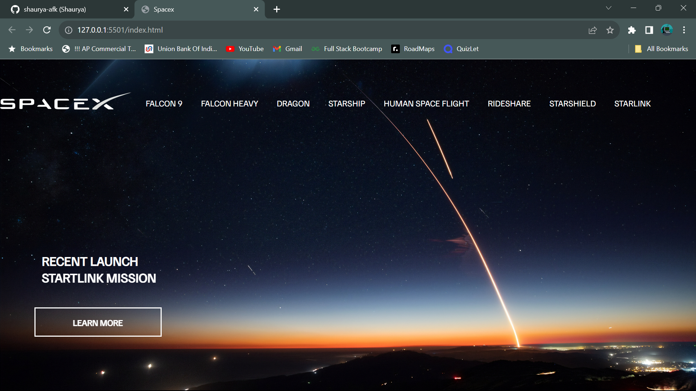

# SpaceX Front-End Clone

Welcome to the SpaceX Front-End Clone repository! This project is a faithful recreation of the SpaceX official website's front-end. It serves as a demonstration of front-end development skills and does not include any backend functionality or real data.

## Live Demo

You can check out a live demo of this SpaceX Front-End Clone .

## Features

- **Homepage**: Explore SpaceX's missions, upcoming launches, and news.
- **Launch Details**: Click on specific launches to view more information.

## Technologies Used

- HTML5
- CSS3

Thanks for checking out!! 😊
